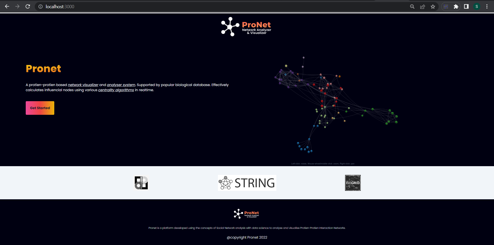
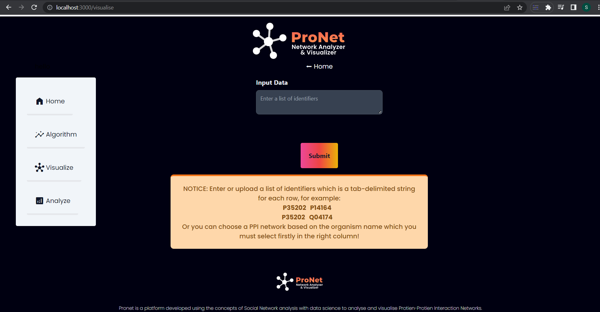
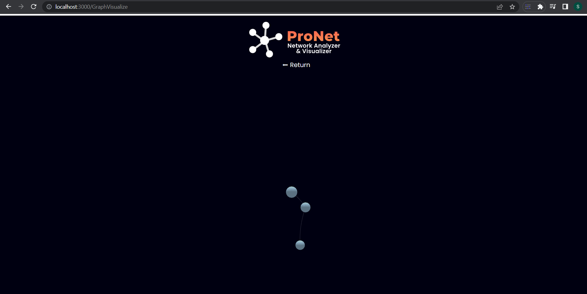
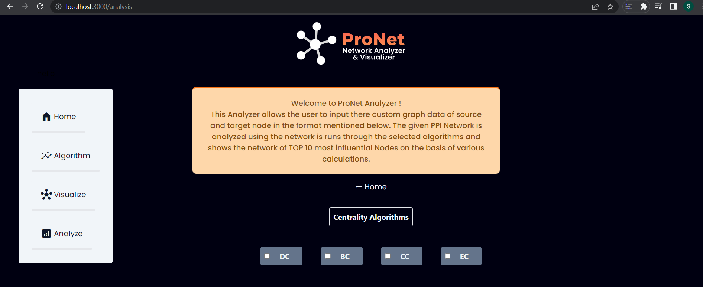
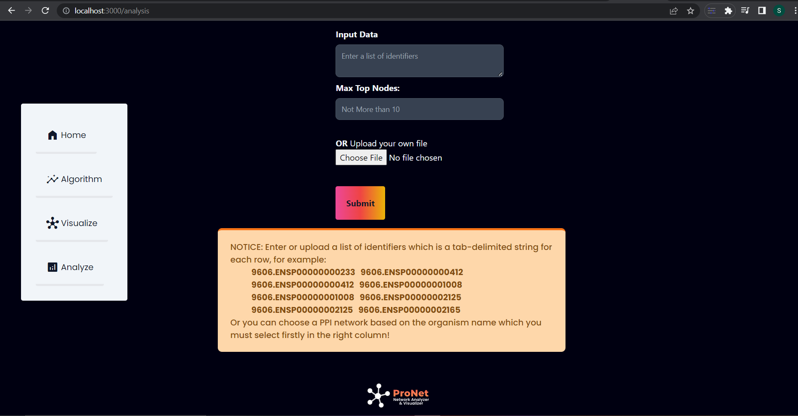
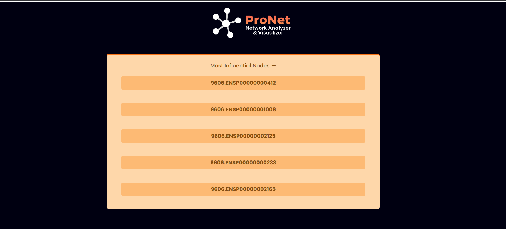
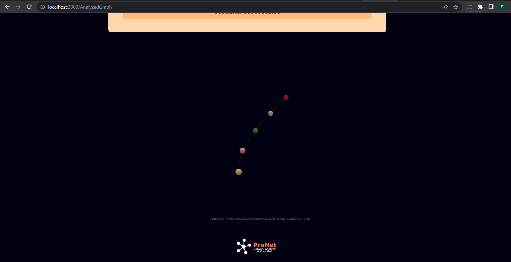

# ProNet - Network Analyzer and Visualizer
(Extention Phase : Working on extention, adding more functionality to the platform.) 

## Description
Pronet is a Protien-Protien Interaction network analyzer and visualizer, that represent the complex biological network in a 3-Dimensional visual Graph structure to provide the user with ease to study any Protein-Protein Interaction network.Our platform provides the feature through which users can upload the data of the network and can analyze the protein protein interaction network with several centrality algorithms to find out the most influential node on the basis of the centrality of a protein node. 

## Tools & Technologies
1. ### languages
    - Javascript
2. ### Libraries & Framework
    - React
    - React-force-graph
    - Tailwind CSS

## Demo Snapshots

### Home

### Visualize

### Analyze

